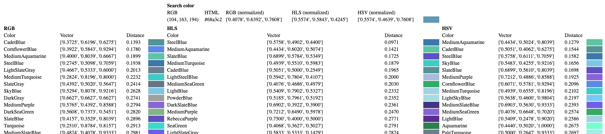
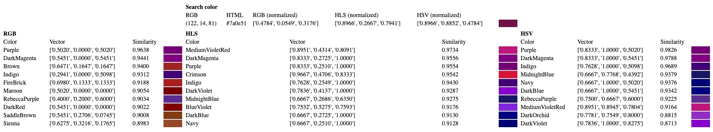

# Vector Search Demo

This repository contains code that exemplifies searching using vectors.

## Requirements

- Python 3.9+
- Poetry

## Installing dependencies

Run:

```bash
poetry install
```

## Running the simple example

For the simple example, it can be run as:

```bash
poetry run python colors.py R G B
```

`R`, `G` and `B` are the RGB components (from 0 to 255) for a color to search. If ommited, a random value will be used.

This execution will generate a file named `colors.html` with the result.



## Running the MongoDB example

For the MongoDB example, you need to create a file named `.env` on the root of the project, with the following content:

```env
MONGODB_CONNECTION_STRING=mongodb+srv://<user>:<password>@<atlas.host>.mongodb.net/?retryWrites=true&w=majority
MONGODB_DATABASE=test
MONGODB_COLLECTION=colors
MONGODB_ATLAS_SEARCH_INDEX=default
```

With `MONGODB_CONNECTION_STRING` being the connection string to a MongoDB Atlas cluster.

Then, you can run:

```bash
poetry run python colors_mongodb.py seed
```

To load the required data into the MongoDB cluster.

Then, go to the Atlas Search configuration, and create a search index on the database you specified on `MONGODB_DATABASE` and the collection you set as `MONGODB_COLLECTION` with the name you specified as `MONGODB_ATLAS_SEARCH_INDEX` with the following content:

```json
{
  "mappings": {
    "fields": {
      "rgb_normalized": [
        {
          "type": "knnVector",
          "dimensions": 3,
          "similarity": "euclidean"
        }
      ],
      "hls_normalized": [
        {
          "type": "knnVector",
          "dimensions": 3,
          "similarity": "euclidean"
        }
      ],
      "hsv_normalized": [
        {
          "type": "knnVector",
          "dimensions": 3,
          "similarity": "euclidean"
        }
      ]
    }
  }
}
```

You can run now the search as:

```bash
poetry run python colors_mongodb.py search R G B
```

This execution will generate a file named `colors-mongodb.html` with the result.

